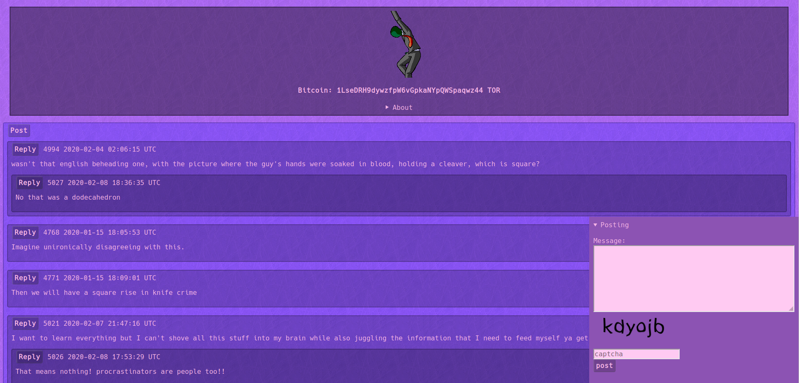

# ratmachine

  

Ratmachine is an javascriptless anonymous textboard engine with various text effects.  

| markup |   effect    |
|--------|-------------|
|   ^^   | 3text       |
|   `    | code        |
|   *    | italic      |
|   **   | bold        |
|   $    | rainbowtext |
|   $$   | shaketext   |
|   %%   | spoiler     |
|   !!   | glowtext    |
|   ==   | redtext     |
|   >    | greentext   |
|   <    | bluetext    |

To start the development environment install docker and docker-compose and use `make build-dev`, from then on you can use `make dev` to boot up the environment. When using the development environment the default username is `wojak` and the password is `tfwnogf`.

To build Ratmachine use `make build`, you will then be able to run ratmachine by executing `bin/ratmachine`.  
On first startup the database will automatically be created and setup, you will then be asked to input a username and password for the mod panel found on `/mod`.
